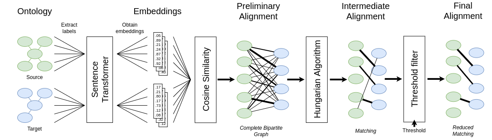

# CIDER-LM

CIDER-LM is an **ontology matching system** focused on the use of **multilingual transformer models**.

The matcher has been developed using **Python**. We use the Maven (Java) framework **MELT** to wrap the Python command in a Java class for easier packaging and evaluation of the matching system.

The system obtains the label for every class and property and get a fixed length embedding. This embedding is obtained using **SBERT multilingual model** from the `sentence-transformers`. These models are trained to obtain pooled embeddings so that similar text (more than one token) is close in the embedding space and the text similarity can be computed using the cosine similarity measure.

## Local Execution (Development)

For local execution, first install the Python virtual environment with the dependencies and then execute the `EvaluateDemoPythonMatcher` Java class using Maven command `mvn`.

### Dependencies

Anaconda (`conda`), Maven (`mvn`) and Java need to be installed for executing the system locally.

Python dependencies are listed in the `./requirements.txt` file. They are automatically installed in the Anaconda virtual environment.

### Python Virtual Environment

1. `conda env create -f ./environment.yml`
2. `conda activate ciderlm-env` or copy the virtual environment's command to `./ciderlm/oaei-resources/python_command.txt` (_e.g._ `$USER/anaconda3/envs/ciderlm-env/bin/python`)

### Execute Command

1. `cd ciderlm`
2. Compile: `mvn package`
3. Execute: `mvn exec:java -Dexec.mainClass="es.unizar.sid.ciderlm.EvaluateDemoPythonMatcher"`

Executing `mvn clean install -Djava.net.preferIPv4Stack=true` Python, Java and Maven are installed in a container along all the dependencies. The `-D` option is recommended to avoid network failures in the do

## OAEI22

### Web Docker Container (OAEI22 submission)
