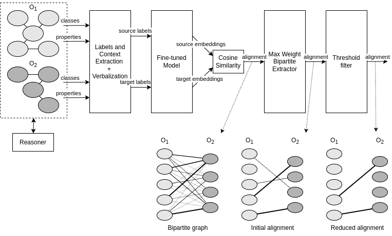

# CIDER-LM

CIDER-LM is an **ontology matching system** focused on the use of **multilingual transformer models**. It is inspired by CIDER (Context and Inference basED ontology alignER) but with a completely new underlying technique, design, and implementation.

The matcher has been developed using **Python**. We use the Maven (Java) framework **MELT** to wrap the Python command in a Java class for easier packaging and evaluation of the matching system.

The system obtains the label for every class and property and get a fixed length embedding. This embedding is obtained using **SBERT multilingual model** from the `sentence-transformers`. These models are trained to obtain pooled embeddings so that similar text (more than one token) is close in the embedding space and the text similarity can be computed using the cosine similarity measure.

## Publications

- [CIDER-LM (prelim) OAEI22](docs/CIDER-LM_prelim.pdf)

## Local Execution (Development)

For local execution, first install the Python virtual environment with the dependencies and then execute the `EvaluateDemoPythonMatcher` Java class using Maven command `mvn`.

### Dependencies

Anaconda (`conda`), Maven (`mvn`) and Java need to be installed for executing the system locally.

Python dependencies are listed in the `./requirements.txt` file. They are automatically installed in the Anaconda virtual environment.

### Python Virtual Environment

1. `conda env create -f ./environment.yml`
2. `conda activate ciderlm-env` or copy the virtual environment's command to `./ciderlm/oaei-resources/python_command.txt` (_e.g._ `$USER/anaconda3/envs/ciderlm-env/bin/python`)

### Execute Command

1. `cd ciderlm`
2. Compile: `mvn package`
3. Execute: `mvn exec:java -Dexec.mainClass="es.unizar.sid.ciderlm.EvaluateDemoPythonMatcher"`

## OAEI22

### Web Docker Container (OAEI22 submission)

For OAEI evaluation campaign the submission has to be a containerized web server that can perform the match.

- Execute command: `mvn clean install -Djava.net.preferIPv4Stack=true`
- Python, Java and Maven are installed in a container
- Dependencies are installed (see `pom.xml`)
- `-D` option is recommended to avoid network failures in the download.

## License

CIDER-LM is developed by the SID group (University of Zaragoza).

This program is free software: you can redistribute it and/or modify
it under the terms of the GNU General Public License as published by
the Free Software Foundation, either version 3 of the License, or
(at your option) any later version.

This program is distributed in the hope that it will be useful,
but WITHOUT ANY WARRANTY; without even the implied warranty of
MERCHANTABILITY or FITNESS FOR A PARTICULAR PURPOSE. See the
GNU General Public License for more details.

You should have received a copy of the GNU General Public License
along with this program. If not, see [http://www.gnu.org/licenses/].
